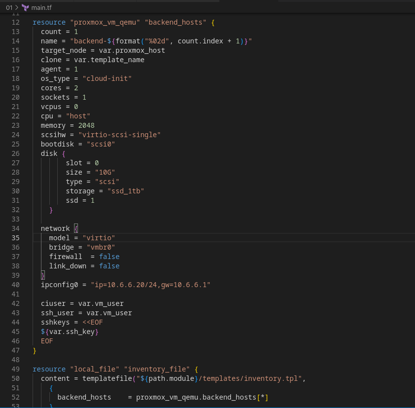
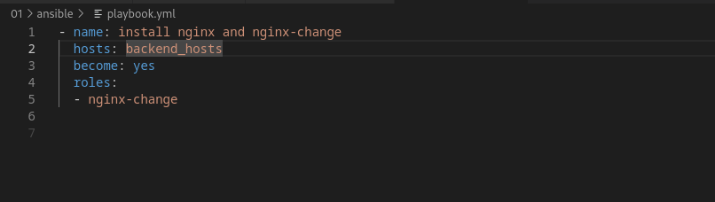
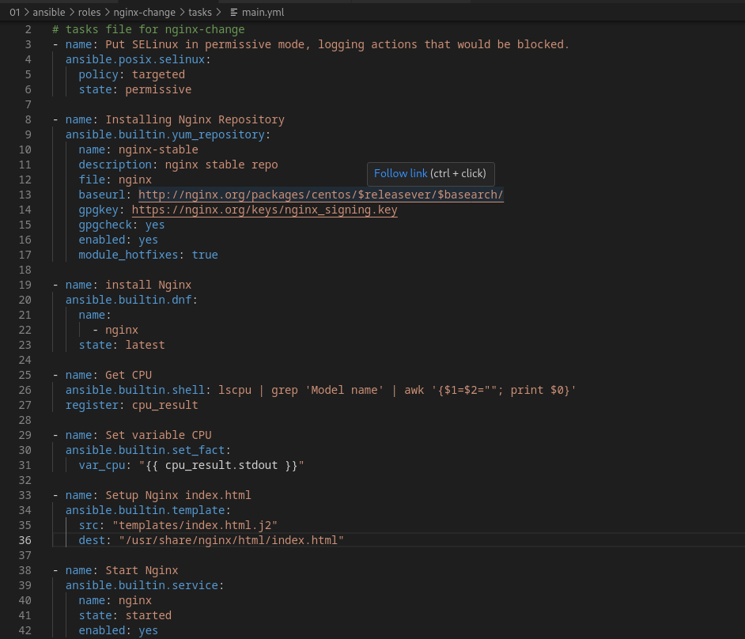
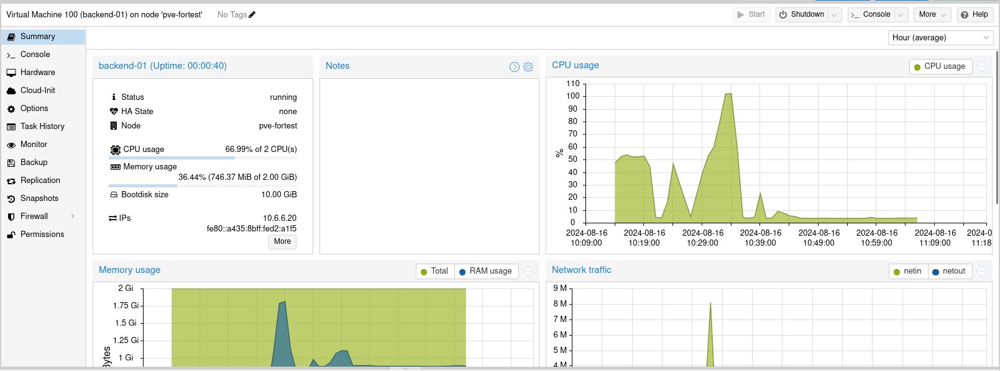
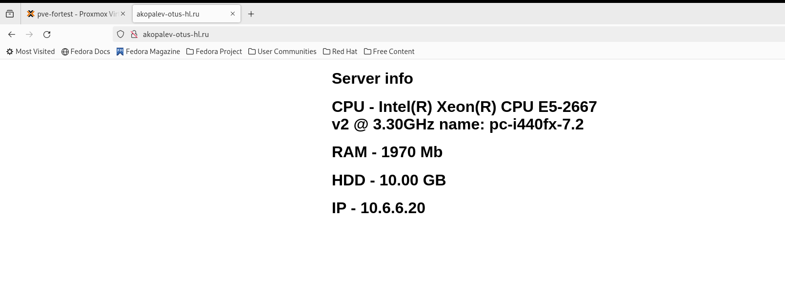

#  Копалев А. С. - Домашняя работа № 1

## Задача
Реализовать терраформ для разворачивания одной виртуалки;
Запровиженить nginx с помощью ansible.

## Реализация
Для развёртки инфраструктуры использовался Tofu и Ansible.
Через Tofu в Proxmox создаются следующие ресурсы:
- 1 виртуальная машина backend-01
- 1 файл inventory для ansible

Через Ansible устанавливается nginx и заменяется его конфиг (реализация через роли)

[main.tf](./main.tf)

[playbook.tf](./ansible/playbook.yml)

## Описание пошагового выполнения со скриншотами

- main.tf
  

- playbook.yml
  

- роль установки и замены конфига nginx

  
- [tofu-output.txt](./tofu-output.txt)
  
- [ansible-output.txt](./ansible-output.txt)
  
- Скриншот из proxmox

- скриншот рабочего веб-сервера
  

