#  Копалев А. С. - Домашняя работа № 2

## Задача
Реализация GFS2 хранилища на виртуалках в Proxmox.
Развернуть в Proxmox следующую конфигурацию с помощью ansible.
Виртуалка с iscsi
3 виртуальные машины с разделяемой файловой системой GFS2 поверх cLVM

## Реализация
Для развёртки инфраструктуры использовался Ansible.
Ansible в Proxmox создаются следующие ресурсы:
- 1 виртуальная машина iscsi-srv с дополнительным диском, который предоставляется как блочное устройство через tergetcli для кластера Pacemaker
- 3 виртуальные машины для кластера Pacemaker

Далее через Ansible реализуются 3 роли:
 - "install targetcli, create lun" - устанавливает targetcli, создает LUN, прописывает ACL клиентов (переменные зашифрованы через ansible-vault)
 - "install iscsi-client" - устанавливает iscsi-клиент, подключает LUN с сервера как блочное устройство
 - "install ha-cluster" - устанавливает pacemaker, pcs, fence agent, lvm2-cluster, gfs2. Настраивает кластер, создает необходимые ресурсы, создает кластерную ФС.

[playbook.yml](./playbook.yml)

## Скриншоты из Proxmox, созданных виртуальных машин, выводы при выполнении ansible-playbook playbook.yml

- виртуальные машины в Yandex Cloud
  
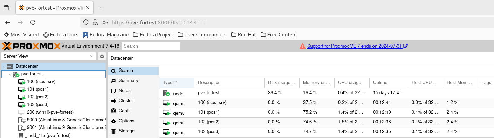

- дополнительный диск для сервера iscsi-srv
  
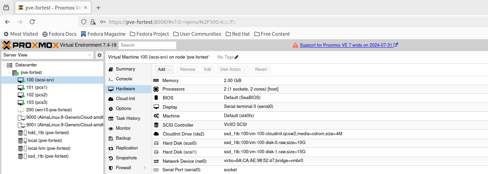

- вывод с сервера iscsi с созданным LUN и прописанными ACL
  
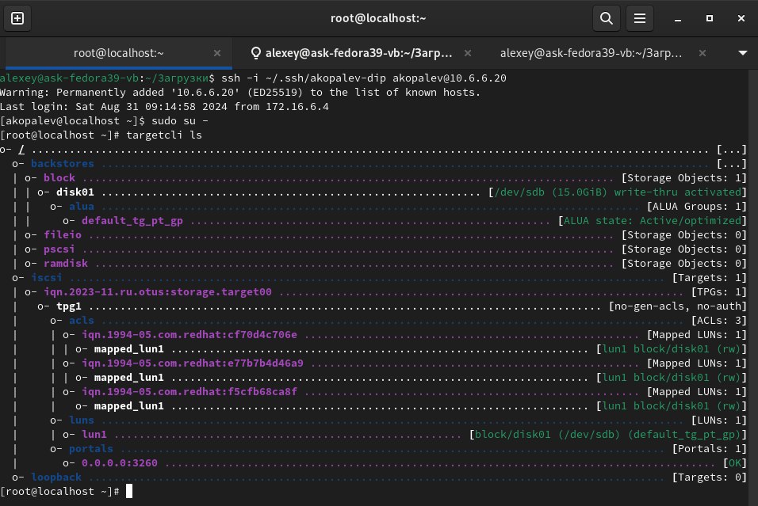

- выводы lsblk с виртуальных машин кластера

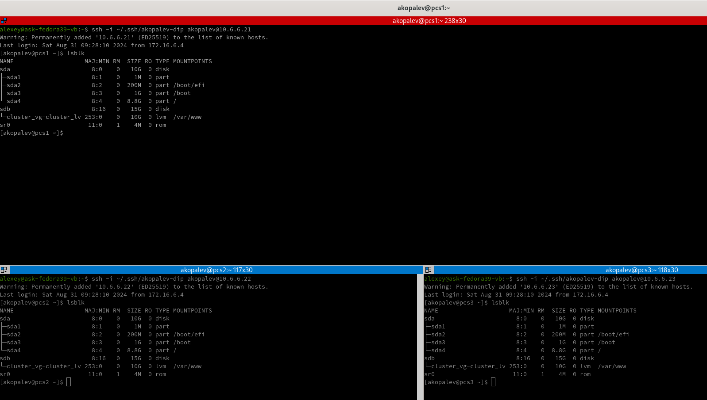

- статус кластера pcs

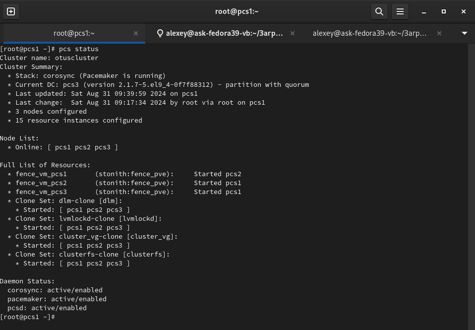

- ресурсы pcs

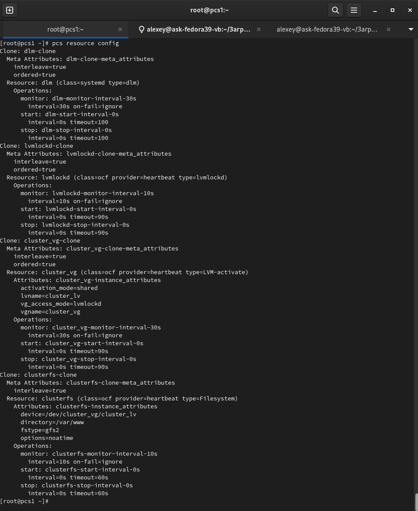

- тест работы обшей файловой системы на виртуалках кластера

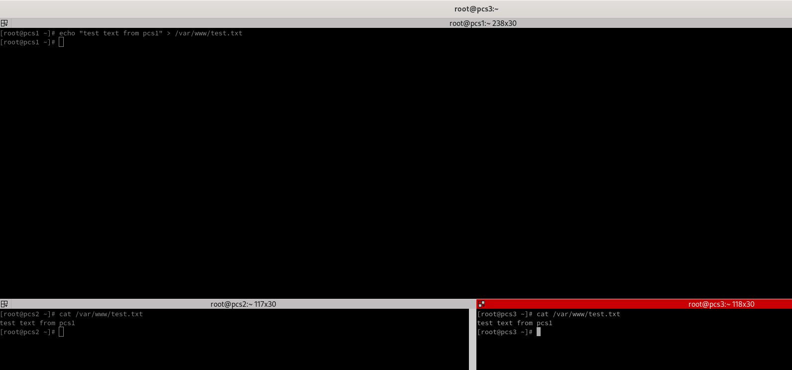

- проверка работы fensing agent (отключим сеть на одной из виртуалок, выведем информацию о работе stonith)

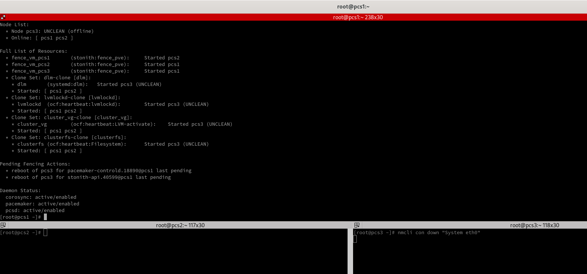

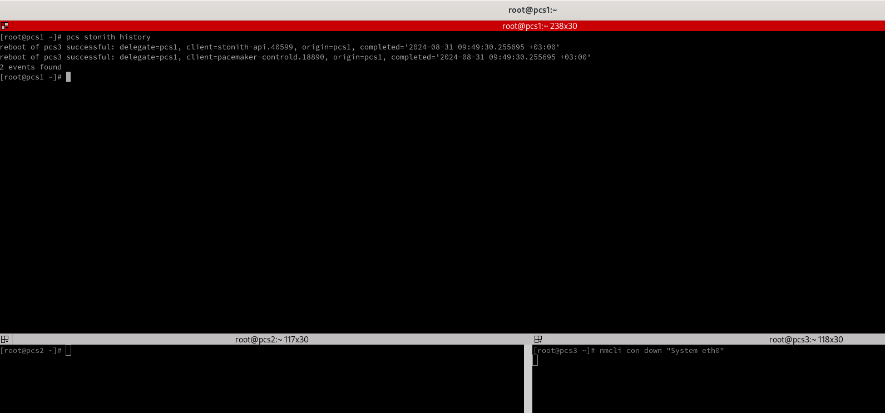

- восстановление работы кластера

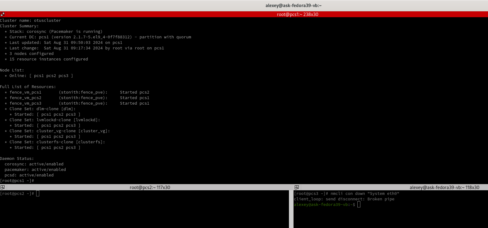

- вывод ansible
    
- [ansible-output.txt](files/ansible-output.txt)

Для удаления инфраструктуры реализована роль  - remove-vm. Запуск командой - ansible-playbook remove-vm.yml

- 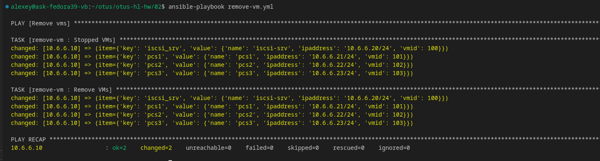