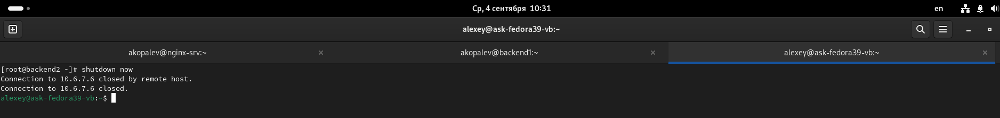

#  Копалев А. С. - Домашняя работа № 3

## Задача
Научиться использовать Nginx в качестве балансировщика.
Развернуть 4 виртуалки:
1 виртуалка - Nginx - с публичным IP адресом,
2 виртуалки - бэкенд на выбор студента ( любое приложение из гитхаба - uwsgi/unicorn/php-fpm/java) + nginx со статикой,
1 виртуалкой с БД на выбор mysql/mongodb/postgres/redis.
## Реализация
Создана DNS A-запись для домена akopalev-otus-hl.ru
Для развёртки инфраструктуры использовался Ansible.
Через Ansible в Proxmox создаются следующие ресурсы:
- 1 виртуальная машина bast-host с внешним IP-адресом, доступная по SSH, реализующая SSH доступ к остальным виртуалкам
- 1 виртуальная машина для БД MySQL
- 1 виртуальная машина для Nginx в качестве балансировщика
- 2 виртуальные машины для бэкенда Wordpress

Через Ansible реализуются 3 роли:
 - "db" - устанавливает MySQL, задает пароль root, создает БД, пользователя и пароль для Wordpress (переменные зашифрованы через ansible-vault)
 - "wordpress" - устанавливает на бэкенд сервера nginx и wordpress, заменяет их конфиги
 - "loadbalancer" - устанавливает nginx и настраивает его в качестве балансировщика.

[playbook.tf](./playbook.yml)

## Скриншоты из Proxmox, созданного сайта, выводы ansible-playbook playbook.yml

- созданные виртуалки в Proxmox
  

 
- Завершение установки Wordpress

- Работа админки сайта

- Работа сайта

- выключение одной из виртуалок бэкенда

- Состояние виртуалок в Proxmox

- Проверка работы админки сайта

- выключение другой виртуалки бэкенда

- Состояние виртуалок в Proxmox

- Проверка работы админки сайта

- Проверка работы сайта

- вывод ansible
  
- [ansible-output.txt](files/ansible-output.txt)

Для удаления инфраструктуры реализована роль - remove-vm. Запуск командой - ansible-playbook remove-vm.yml

