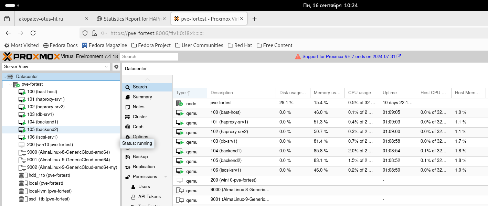
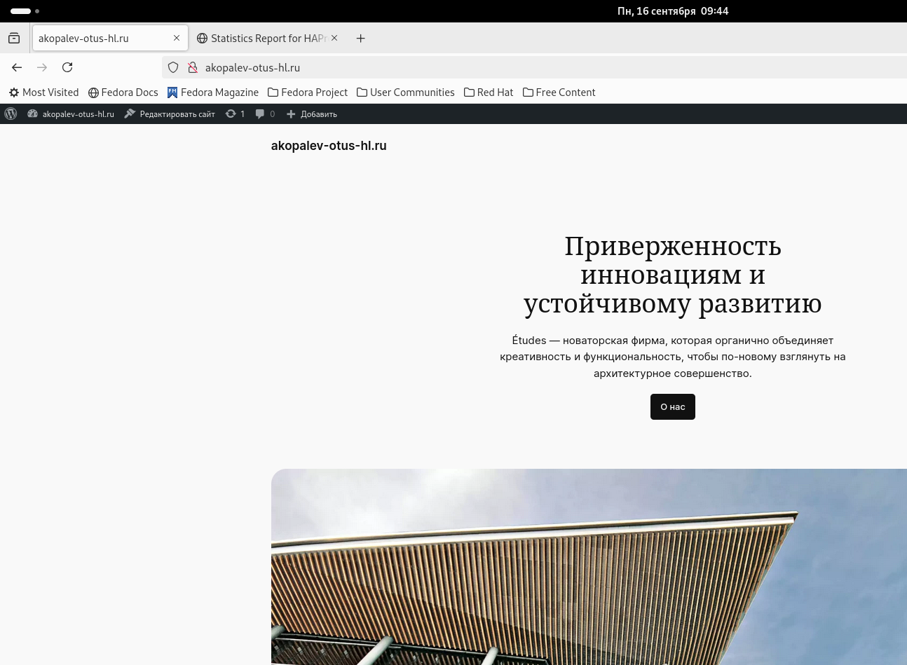
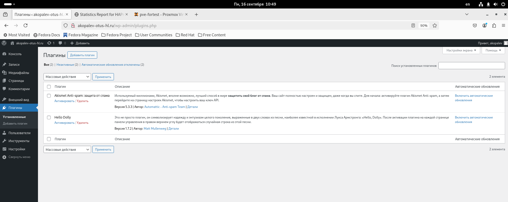

#  Копалев А. С. - Домашняя работа № 4

## Задача
Настройка конфигурации веб приложения под высокую нагрузку
#### Цель:
terraform (или vagrant) и ansible роль для развертывания серверов веб приложения под высокую нагрузку и отказоустойчивость
в работе должны применяться:
keepalived, (в случае использовать vagrant и virtualbox), load balancer от yandex в случае использования яндекс клауд
nginx,
uwsgi/unicorn/php-fpm
некластеризованная бд mysql/mongodb/postgres/redis
## Реализация
Для развертывания инфраструктуры использовался Ansible.
Через роль create-vm в Proxmox создаются следующие ресурсы (через модули):
- 1 виртуальная машина bast-host с внешним IP-адресом, доступная по SSH, реализующая SSH доступ к остальным виртуалкам
- 1 виртуальная машина для сервера ISCSI с дополнительным диском
- 1 виртуальная машина для БД MySQL
- 2 виртуальные машины для бэкенда Wordpress
- 2 виртуальные машины для фронтенда keepalived+haproxy

Через Ansible реализуются 6 ролей:
 - "chrony" - установка и синхронизация времени на всех виртуальных машинах
 - "targetcli" - устанавливает targetcli, создает LUN, прописывает ACL клиентов (переменные зашифрованы через ansible-vault) для использования в качестве общей ФС gfs2 для бэкенд серверах, для хранения статики
 - "iscsi-client" - устанавливает iscsi-клиент, подключает LUN с сервера как блочное устройство 
 - "ha-cluster" - станавливает pacemaker, pcs, fence agent, lvm2, lvm2-lockd, dlm,gfs2-utils. Настраивает кластер, создает необходимые ресурсы, создает кластерную ФС.
 - "db" - устанавливает MySQL, задает пароль root, создает БД, пользователя и пароль для Wordpress (переменные зашифрованы через ansible-vault)
 - "wordpress" - устанавливает на бэкенд сервера nginx и каталог wordpress в директорию но общей ФС, заменяет их конфиги

[playbook.yml](./playbook.yml)

## Скриншоты из Proxmox, созданного сайта, вывод при выполнении ansible-playbook playbook.yml

- созданные виртуальные машины в Proxmox
  

- Завершение установки Wordpress

- Работа админки сайта

- Проверка работы сайта

- pcs status на одной из нод бэкенда

- lsbkl

- выключение backend2, pcs status на backend1

- состояние виртуалок

- Проверки состояния HAProxy

- Проверка работы админки сайта

- Проверка работы сайта

- включение бэкенд 2

- Проверки состояния HAProxy

- pcs status

- проверка работы fensing agent (отключим сеть на одной из виртуалок, выведем информацию о работе stonith)

- проверка работы Keepalived (выключид одну из виртуалок фронтенда, проверим ip-адреса на второй, ping на "плавающий" ip не прервался)

- состояние виртуалок

- Проверки состояния HAProxy

- Проверка работы админки сайта

- Проверка работы сайта

- вывод ansible
  
- [ansible-output.txt](files/ansible-output.txt)

Для удаления инфраструктуры реализована роль - remove-vm. Запуск командой - ansible-playbook remove-vm.yml

