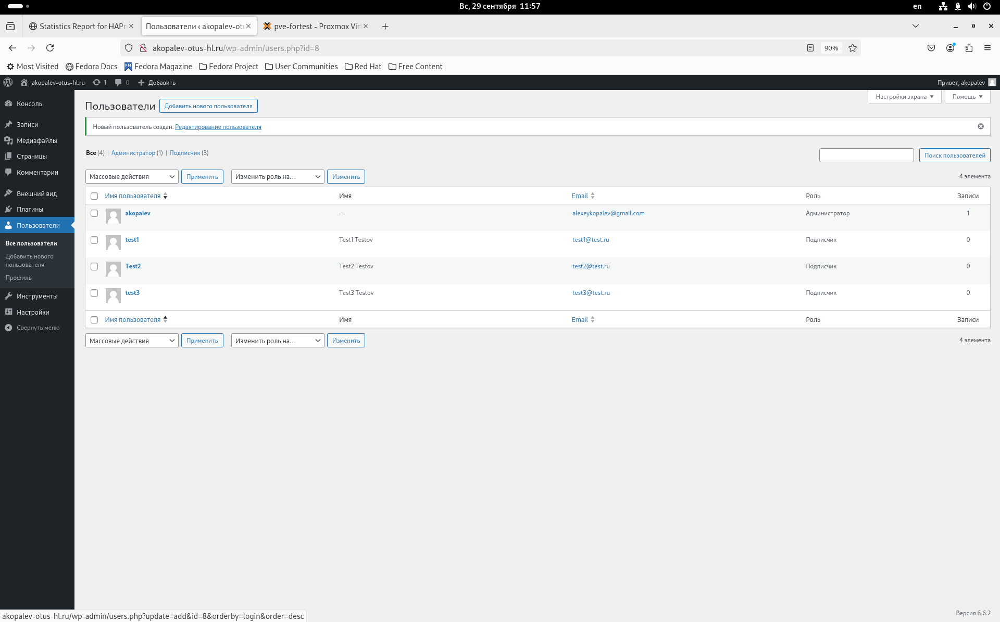

#  Копалев А. С. - Домашняя работа № 3

## Задача
Развернуть InnoDB или PXC кластер
#### Цель
Перевести базу веб-проекта на один из вариантов кластера MySQL: Percona XtraDB Cluster или InnoDB Cluster.
#### Описание/Пошаговая инструкция выполнения домашнего задания:
Разворачиваем отказоустойчивый кластер MySQL (PXC || Innodb) на ВМ или в докере любым способом
Создаем внутри кластера вашу БД для проекта
#### Выполнение
Для развёртки инфраструктуры использовался Ansible.
Через Ansiblem в Proxmox (ansible-playbook create-mv.yml) создаются следующие ресурсы:
- 1 виртуальная машина bast-host с внешним IP-адресом, доступная по SSH, реализующая SSH доступ к остальным виртуалкам
- 3 виртуальные машина для Percona XtraDB Cluster
- 2 виртуальные машины для бэкенда Wordpress + ProxySQL
- 1 виртуальная машина с доп. диском для общего хранилища виртуальных машин backend
- 2 виртуальные машины для фронтенда keepalived+haproxy

[create-vms.txt](./files/create-vms.txt)

Через Ansible реализуются 7 ролей:
 - "chrony" - установка и синхронизация времени на всех виртуальных машинах
 - "targetcli" - устанавливает targetcli, создает LUN, прописывает ACL клиентов (переменные зашифрованы через ansible-vault) для использования в качестве общей ФС gfs2 для бэкенд серверах, для хранения статики
 - "iscsi-client" - устанавливает iscsi-клиент, подключает LUN с сервера как блочное устройство 
 - "ha-cluster" - станавливает pacemaker, pcs, fence agent, lvm2, lvm2-lockd, dlm,gfs2-utils. Настраивает кластер, создает необходимые ресурсы, создает кластерную ФС.
 - "db" - устанавливает кластер MySQL: Percona XtraDB Cluster, задает пароль root, создает БД Wordpress, пользователей и пароли для подключения ProxySQL (переменные зашифрованы через ansible-vault)
 - "proxysql" - устанавливает ProxySQL на бэкенд сервера для подключения к кластеру ДБ, задает пароль admin, создает пользователей и пароли для подключния Wordpress (переменные зашифрованы через ansible-vault)
 - "wordpress" - устанавливает на бэкенд сервера nginx и каталог wordpress в директорию но общей ФС, заменяет их конфиги
 - "keepalived" - - устанавливает на фронтенд сервера HAProxy и Keepalived для плавающего IP

[playbook.yml](./playbook.yml)

## Скриншоты из Proxmox, созданного сайта, выводы при выполнении ansible-playbook playbook.yml

- созданные виртуальные машины в Proxmox
  

- Заканчиваем установку Wordpress
  

- Работа админки сайта
  

- Работа сайта
  

- Информация о кластере СУБД (SHOW STATUS LIKE 'wsrep%';)
  

- Проверяем сосояние кластера MySQL через ProxySQL

- Проверяем работу БД, добавляем запись в БД через сайт.

- Проверяем репликацию на всех нодах БД

- Выключение виртуалки MySQL - db-srv1

- Сосояние кластера MySQL

- Прверка работы сайта

- Добавим запись в БД

- Проверяем репликацию на 2 оставшихся нодах

- Запускаем выключенную виртуалку проверяем состояние кластера

- Выключение виртуалоки MySQL - db-srv3

- Сосояние кластера СУБД (SHOW STATUS LIKE 'wsrep%';)

- Состояние виртуалок в Proxmox

- Добавим запись в БД

- Проверяем репликацию на 2 оставшихся нодах

- Включаем выключенную виртуалку кластера БД

- Сосояние кластера СУБД (SHOW STATUS LIKE 'wsrep%';)

- Проверяем записи в таблице на всех нодах кластера

- вывод ansible-playbook playboor.yml
  
- [ansible-output.txt](files/ansible-output.txt)

### Для удаления инфраструктуры реализована роль - remove-vm. Запуск командой - ansible-playbook remove-vm.yml

- [remove-vms.txt](files/remove-vms.txt)