#  Копалев А. С. - Домашняя работа № 7

## Задача
Настройка централизованного сбора логов в кластер Opensearch.
#### Цель
Настроить централизованный сбор логов с различных серверов проекта и их хранение в кластер Elasticsearch для удобного поиска и анализа;
#### Описание/Пошаговая инструкция выполнения домашнего задания:

1. Развертывание кластера Elasticsearch:
Создать и настроить кластер Elasticsearch:
Развернуть кластер Elasticsearch, состоящий из как минимум трех виртуальных машин (ВМ), которые будут выполнять функции узлов кластера.
Убедитесь, что каждая ВМ работает с установленным Elasticsearch.
Настроить узлы кластера:
Обеспечить правильную конфигурацию узлов для работы в кластере, включая настройку сетевого взаимодействия и параметров кластера (например, discovery.seed_hosts, cluster.initial_master_nodes).
2. Настройка сбора логов:
Выбрать инструмент для сбора логов:
Решите, какой инструмент будет использоваться для сбора логов с серверов. Возможные варианты включают Filebeat, Logstash или другой подходящий агрегатор логов.
Установить и настроить инструмент для сбора логов:
Установите выбранный инструмент на все серверы проекта, включая веб-серверы, балансеры и базы данных.
Настройте его для отправки логов в кластер Elasticsearch.
Конфигурировать шаблоны и индексы:
Создайте и настройте шаблоны индексов и правила для обработки логов в Elasticsearch, чтобы обеспечить правильное хранение и структурирование данных.
3. Проверка и тестирование:
Проверить сбор логов:
Убедитесь, что логи корректно собираются и отправляются в Elasticsearch.
Проверьте, что данные появляются в Elasticsearch и могут быть проанализированы.
Настроить визуализацию:
Опционально, для удобства анализа, настройте инструменты визуализации, такие как Kibana, для просмотра и анализа собранных логов.
#### Выполнение
Для развёртки инфраструктуры использовался Ansible.
Через Ansiblem в Proxmox (ansible-playbook create-mv.yml) создаются следующие ресурсы:
- 1 виртуальная машина bast-host с внешним IP-адресом, доступная по SSH, реализующая SSH доступ к остальным виртуалкам
- 3 виртуальные машины для кластера postgreSQL с ипользованием patroni, etcd
- 2 виртуальные машины для бэкенда CMS Joomla
- 1 виртуальная машина с доп. диском для общего хранилища виртуальных машин backend
- 2 виртуальные машины для фронтенда keepalived+haproxy
- 3 виртуальные машины для кластера OpenSearch
- 1 виртуальные машины для Opensearch Dashboard

[create-vms.txt](./files/create-vms.txt)

Через Ansible реализуются 10 ролей:
 - "chrony" - установка и синхронизация времени на всех виртуальных машинах
 - "targetcli" - устанавливает targetcli, создает LUN, прописывает ACL клиентов (переменные зашифрованы через ansible-vault) для использования в качестве общей ФС gfs2 для бэкенд серверах, для хранения статики
 - "iscsi-client" - устанавливает iscsi-клиент, подключает LUN с сервера как блочное устройство 
 - "ha-cluster" - устанавливает pacemaker, pcs, fence agent, lvm2, lvm2-lockd, dlm, gfs2-utils, haproxy. Настраивает кластер, создает необходимые ресурсы, создает кластерную ФС. Настраивает HAProxy для работы с кластером PostgreSQL
 - "pgsql-cluster" - устанавливает кластер PostgreSQL с ипользованием patroni, etcd, создает БД CMS Joomla (переменные зашифрованы через ansible-vault)
 - "loomla" - устанавливает на бэкенд сервера nginx и каталог joomla в директорию на общей ФС, заменяет конфиг nginx
 - "keepalived" - устанавливает на фронтенд сервера HAProxy и Keepalived для плавающего IP
 - "opensearch" - устанавливает и настраивает кластер Opensearch
 - "dashboards" - устанавливает и настраивает Opensearch Dashboard
 - "fluent-bit" - устанавливает на все сервера стенда fluent-bit и настраевает его на отправку логов на сервер Opensearch
 
[playbook.yml](./playbook.yml)

## Скриншоты из Proxmox, созданного сайта, выводы при выполнении ansible-playbook playbook.yml

- созданные виртуальные машины в Proxmox
  
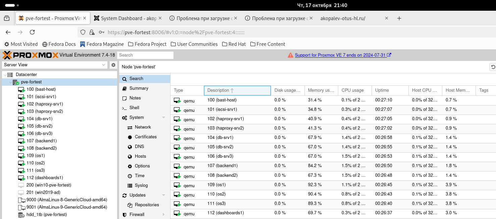

- Заканчиваем установку Joomla
  
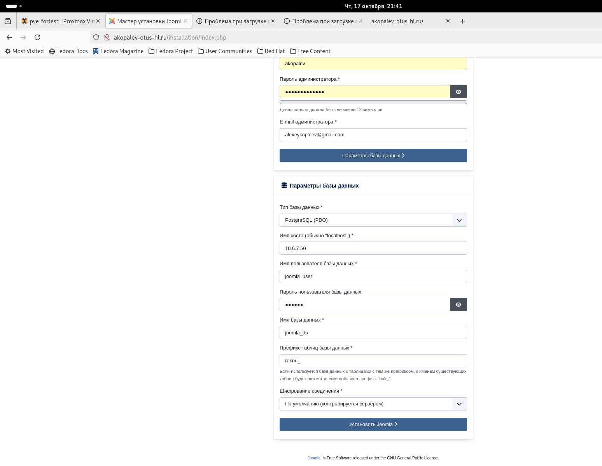

- Работа админки сайта
  
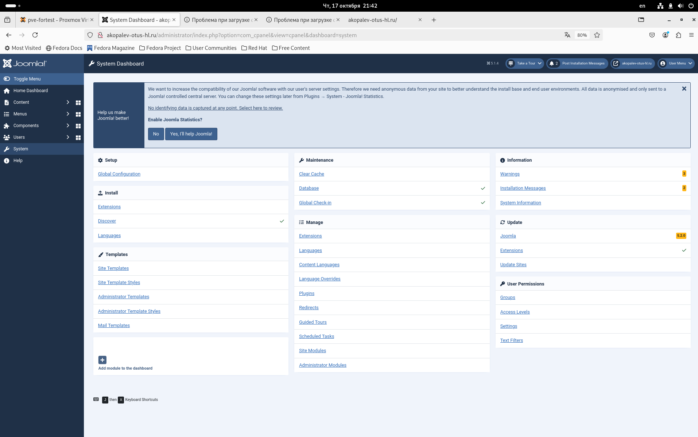

- Работа сайта
  
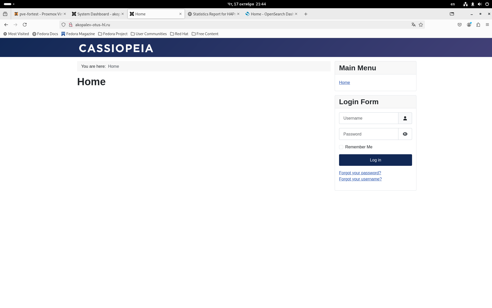

- Проверяем HAProxy

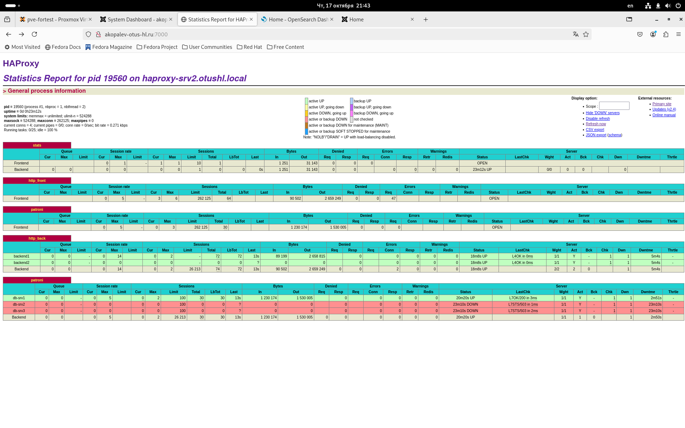

- Проверяем Opensearch Dashboard

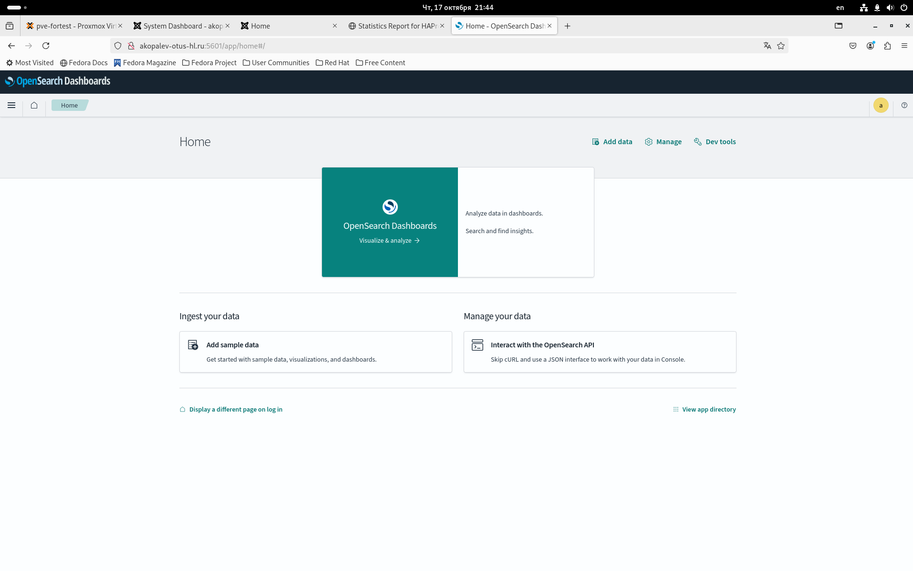

- Проверяем сосояние кластера Opensearch

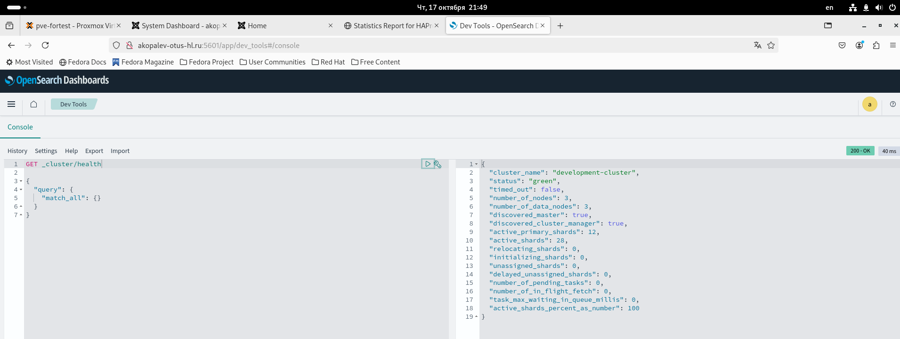

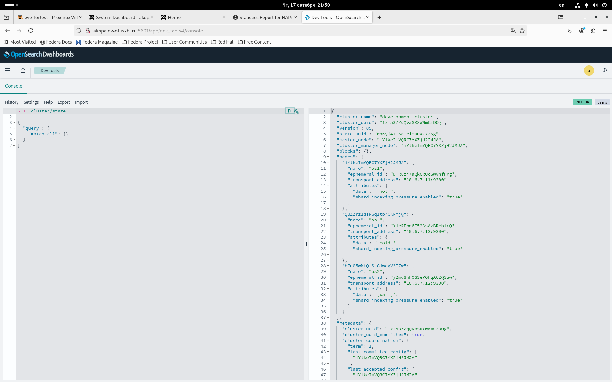

- Добавляем индексы со всех серверов.

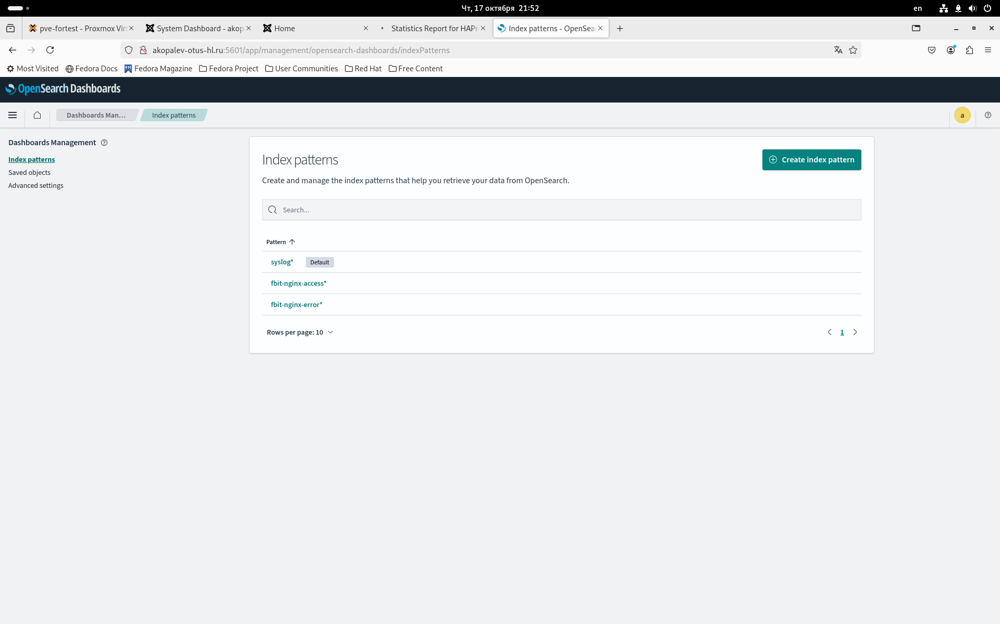

- Проверяем сбор syslog

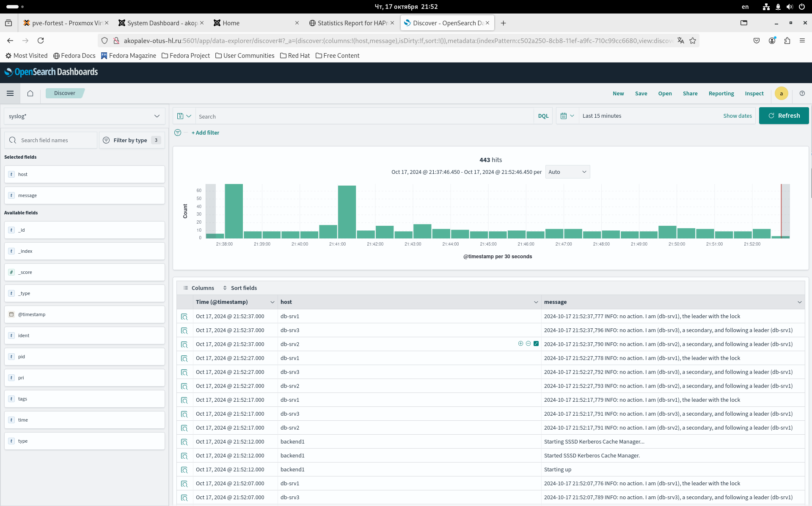

- Проверяем сбор логов nginx access с серверов backend

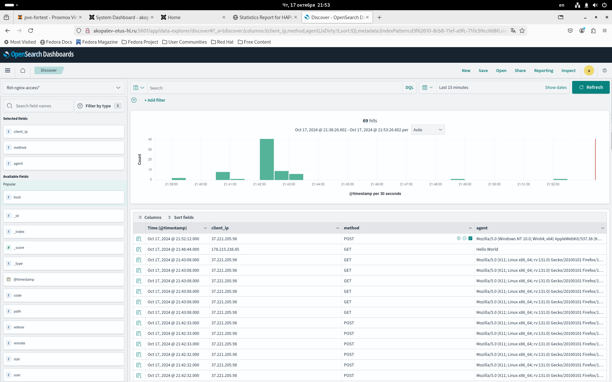

- Проверяем сбор логов nginx error с серверов backend

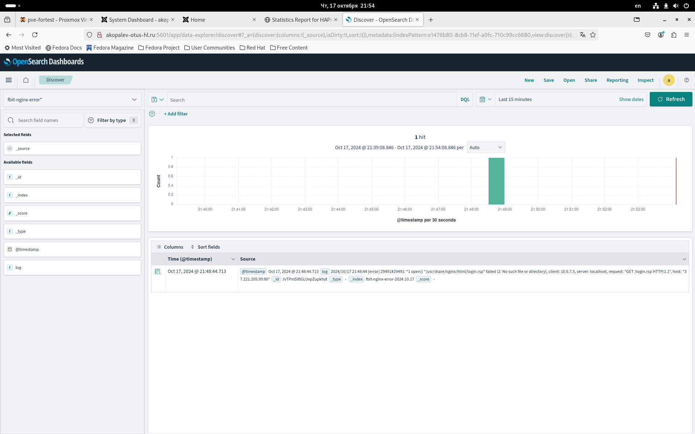

- Проверяем фильтры по собранным логам

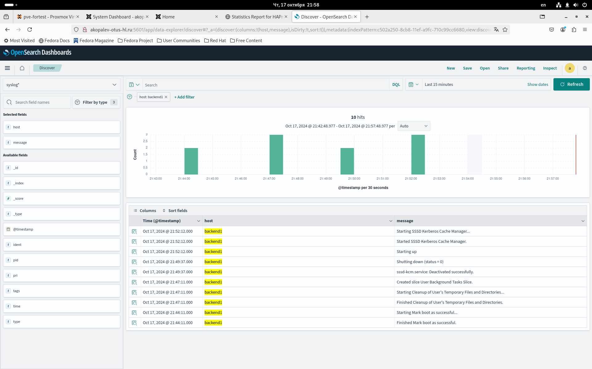

- вывод ansible-playbook playboor.yml
  
- [ansible-output.txt](files/ansible-output.txt)

### Для удаления инфраструктуры реализована роль - remove-vm. Запуск командой - ansible-playbook remove-vm.yml

- [remove-vms.txt](files/remove-vms.txt)