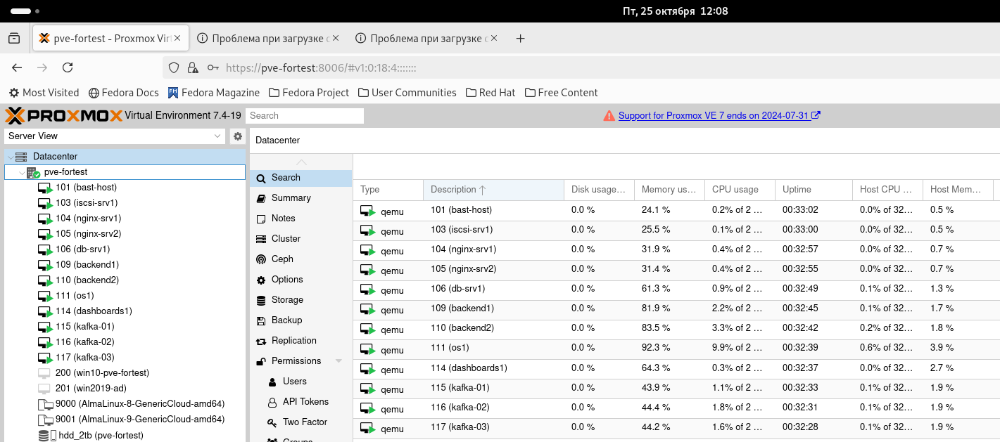
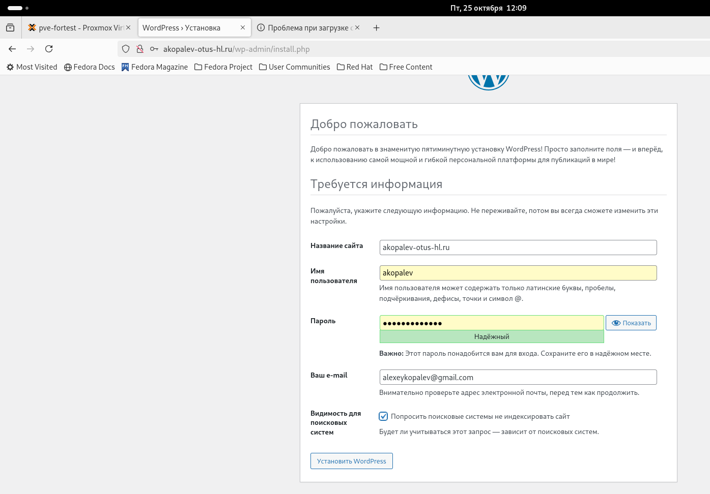
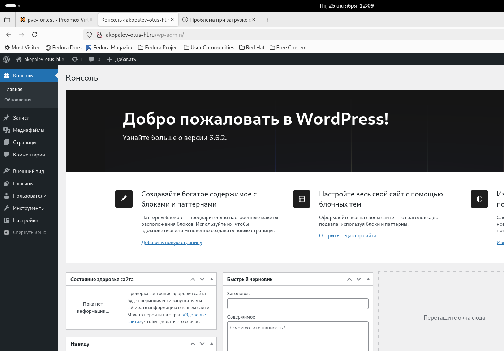
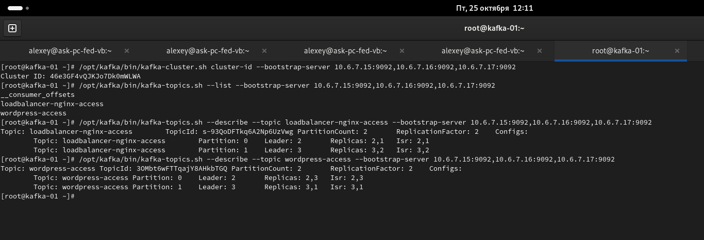
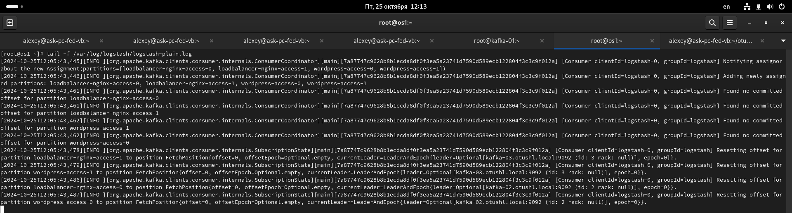
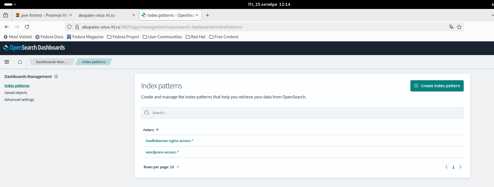
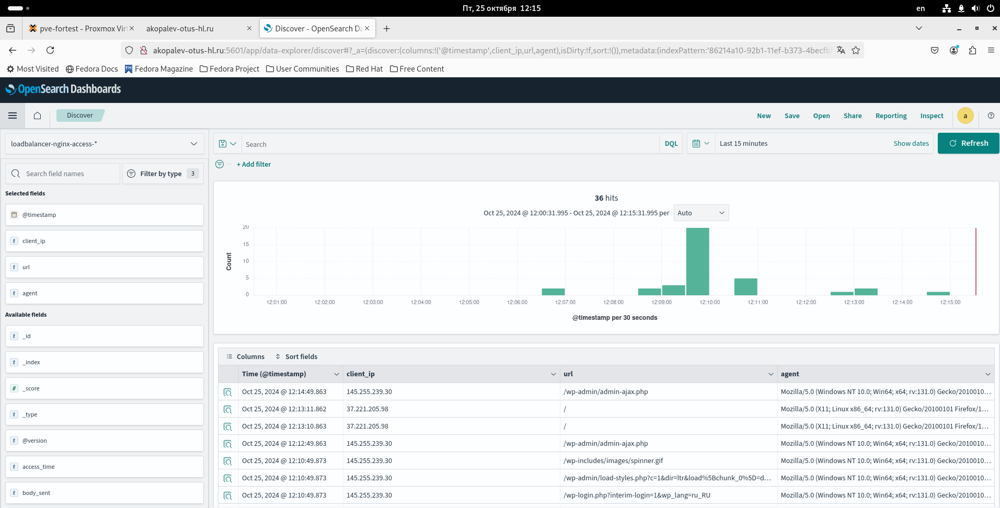
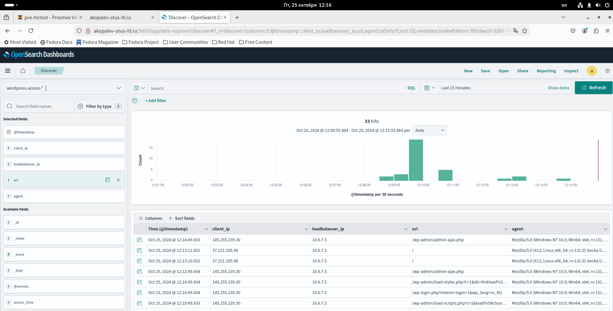
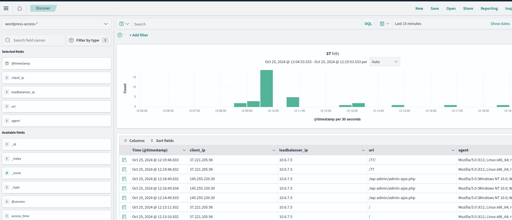

#  Копалев А. С. - Домашняя работа № 8

## Задача
Реализация очереди для сборщика логов между logstash и elasticsearch.
#### Цель
настроить сбор логов с веб портала реализованного ранее
настроить kafka как промежуточную очередь между logstash и elasticsearch
#### Описание/Пошаговая инструкция выполнения домашнего задания:

развернуть кафку на 1 ноде
создать 2 топика по 2 партиции и 2 реплики (nginx и wordpress)
на каждой ноде поставить на выбор filebeat/fluentd/vector
собирать этим утилитами логи nginx и wordpress
отправлять в 2 разных топика nginx и wordpress
развернуть ELK на одной ноде
настроить логстэш для забора данных с кафки и сохранение в 2 индекса
настроить индекс паттерны в кибане

Задание повышенной сложности* кафку и ELK развернуть в кластере
#### Выполнение
Для развёртки инфраструктуры использовался Ansible.
Через Ansiblem в Proxmox (ansible-playbook create-mv.yml) создаются следующие ресурсы:
- 1 виртуальная машина bast-host с внешним IP-адресом, доступная по SSH, реализующая SSH доступ к остальным виртуалкам
- 1 виртуальная машина для БД MySQL
- 2 виртуальные машины для бэкенда Wordpress
- 1 виртуальная машина с доп. диском для общего хранилища виртуальных машин backend
- 2 виртуальные машины для Nginx в качестве балансировщика
- 3 виртуальные машины для кластера OpenSearch
- 1 виртуальные машины для Opensearch Dashboard
- 3 виртуальные машины для кластера Kafka

[create-vms.txt](./files/create-vms.txt)

Через Ansible реализуются 10 ролей:
 - "chrony" - установка и синхронизация времени на всех виртуальных машинах
 - "targetcli" - устанавливает targetcli, создает LUN, прописывает ACL клиентов (переменные зашифрованы через ansible-vault) для использования в качестве общей ФС gfs2 для бэкенд серверах, для хранения статики
 - "iscsi-client" - устанавливает iscsi-клиент, подключает LUN с сервера как блочное устройство 
 - "ha-cluster" - устанавливает pacemaker, pcs, fence agent, lvm2, lvm2-lockd, dlm, gfs2-utils, haproxy. Настраивает кластер, создает необходимые ресурсы, создает кластерную ФС. Настраивает HAProxy для работы с кластером PostgreSQL
 - "db" - устанавливает MySQL, задает пароль root, создает БД, пользователя и пароль для Wordpress (переменные зашифрованы через ansible-vault)
 - "wordpress" - устанавливает на бэкенд сервера nginx и wordpress, заменяет их конфиги
 - "loadbalancer" - устанавливает nginx и настраивает его в качестве балансировщика.
 - "opensearch" - устанавливает и настраивает кластер Opensearch
 - "dashboards" - устанавливает и настраивает Opensearch Dashboard
 - "fluent-bit" - устанавливает на сервера фронтенда и бекенда fluent-bit и настраевает его на отправку логов на кластер Kafka
 - "kafka" - устанавливает и настраивает кластер Zookeeper и Kafka, создать 2 топика по 2 партиции и 2 реплики (loadbalancer-nginx-access и wordpress-access)
 - "logstash" - устанавливает на сервера Opensearch Logstash и настраевает его на прием, обработку и отправку данных из кластера Kafka и сохранение в 2 индекса в кластер OpenSearch
 
[playbook.yml](./playbook.yml)

## Скриншоты из Proxmox, созданного сайта, выводы при выполнении ansible-playbook playbook.yml

- созданные виртуальные машины в Proxmox
  

- Заканчиваем установку Wordpress
  

- Работа админки сайта
  

- Работа сайта
  

- Проверяем работу кластера Kafka, наличие топиков

- Проверяем работу Logstash

- Добавляем индексы со всех серверов.

- Проверяем сбор логов c топика loadbalancer-nginx-access с серверов fronted

- Проверяем сбор логов c топика wordpess-access с серверов backend

- Проверяем работу по сбору логов

- Проверяем работу по сбору логов

- вывод ansible-playbook playboor.yml
  
- [ansible-output.txt](files/ansible-output.txt)

### Для удаления инфраструктуры реализована роль - remove-vm. Запуск командой - ansible-playbook remove-vm.yml

- [remove-vms.txt](files/remove-vms.txt)