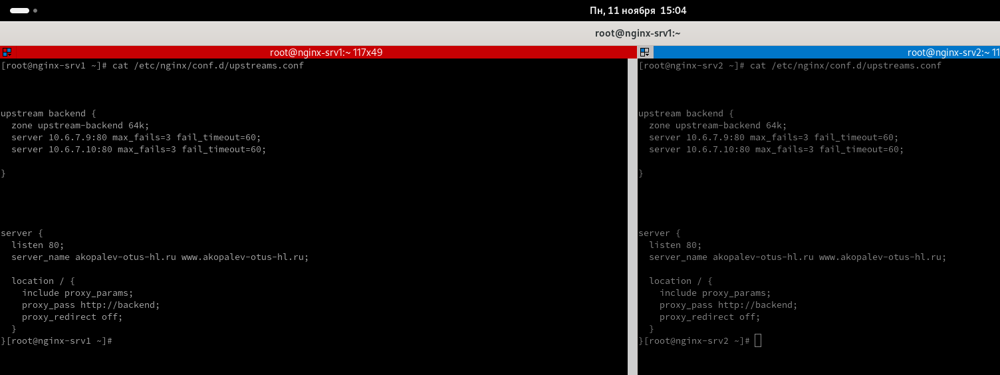

#  Копалев А. С. - Домашняя работа № 9

## Задача
Consul cluster для service discovery и DNS
#### Цель
Реализовать consul cluster который выдает доменное имя для веб портала с прошлой ДЗ.
Плавающий IP заменить на балансировку через DNS.
В случае умирание одного из веб серверов IP должен убираться из DNS.
#### Описание/Пошаговая инструкция выполнения домашнего задания:

Реализовать consul cluster который выдает доменное имя для веб портала с прошлой ДЗ.
Плавающий IP заменить на балансировку через DNS.
В случае умирание одного из веб серверов IP должен убираться из DNS.

#### Выполнение
Для развёртки инфраструктуры использовался Ansible.
Через Ansiblem в Proxmox (ansible-playbook create-mv.yml) создаются следующие ресурсы:
- 1 виртуальная машина bast-host с внешним IP-адресом, доступная по SSH, реализующая SSH доступ к остальным виртуалкам
- 1 виртуальная машина для БД MySQL
- 2 виртуальные машины для бэкенда Wordpress
- 1 виртуальная машина с доп. диском для общего хранилища виртуальных машин backend
- 2 виртуальные машины для Nginx в качестве балансировщика
- 3 виртуальные машины для кластера Consul

[create-vms.txt](./files/create-vms.txt)

Через Ansible реализуются 9 ролей:
 - "chrony" - установка и синхронизация времени на всех виртуальных машинах
 - "targetcli" - устанавливает targetcli, создает LUN, прописывает ACL клиентов (переменные зашифрованы через ansible-vault) для использования в качестве общей ФС gfs2 для бэкенд серверах, для хранения статики
 - "iscsi-client" - устанавливает iscsi-клиент, подключает LUN с сервера как блочное устройство 
 - "ha-cluster" - устанавливает pacemaker, pcs, fence agent, lvm2, lvm2-lockd, dlm, gfs2-utils, haproxy. Настраивает кластер, создает необходимые ресурсы, создает кластерную ФС. Настраивает HAProxy для работы с кластером PostgreSQL
 - "db" - устанавливает MySQL, задает пароль root, создает БД, пользователя и пароль для Wordpress (переменные зашифрованы через ansible-vault)
 - "wordpress" - устанавливает на бэкенд сервера nginx и wordpress, заменяет их конфиги
 - "lb-nginx-consul" - устанавливает nginx и настраивает его в качестве балансировщикa, конфигурация меняется динамически в зависимости от доступности ресурсов в Consul.
 - "consul" - устанавливает и настраивает кластер Consul
 - "keepalived" - плавающий ip между серверами frontend
 
[playbook.yml](./playbooks/playbook.yml)

## Скриншоты из Proxmox, созданного сайта, выводы при выполнении ansible-playbook playbook.yml

- созданные виртуальные машины в Proxmox
  

- Проверяем работу кластера Consul через WebUI
  

- Проверяем работу сервиса backend в consul через WebUI
  

- Проверяем работу кластера Consul через терминал
  

- Проверяем работу сервиса backend в consul через терминал

- Проверяем конфигурацию Nginx на серверах frontend

- Заканчиваем установку Wordpress

- Работа админки сайта

- выключаем один из серверов backend

- Проверяем работу виртуалок

- Проверяем, сервис стал недоступен на одной из нод в Consul

- Проверяем конфигурацию Nginx на серверах frontend, конфиг изменился

- В WebUi Consul сервис остался доступен только на одной ноде

- Проверяем работу админки сайта

- Проверяем работу сайта

- Включаем виртуалку обратно

- В WebUi Consul сервис снова доступен только на обоих нодах

- Проверяем конфигурацию Nginx на серверах frontend, конфиг изменился

- вывод ansible-playbook playboor.yml
  
- [ansible-output.txt](files/ansible-output.txt)

### Для удаления инфраструктуры реализована роль - remove-vm. Запуск командой - ansible-playbook remove-vm.yml

- [remove-vms.txt](files/remove-vms.txt)