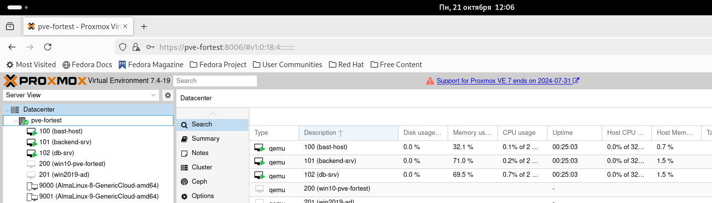
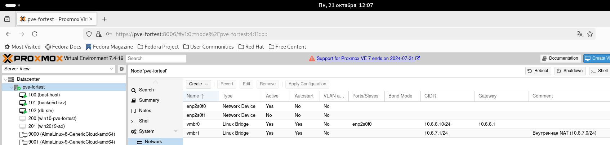
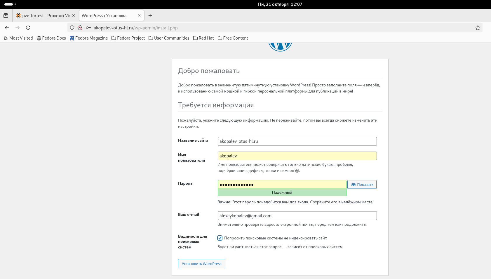
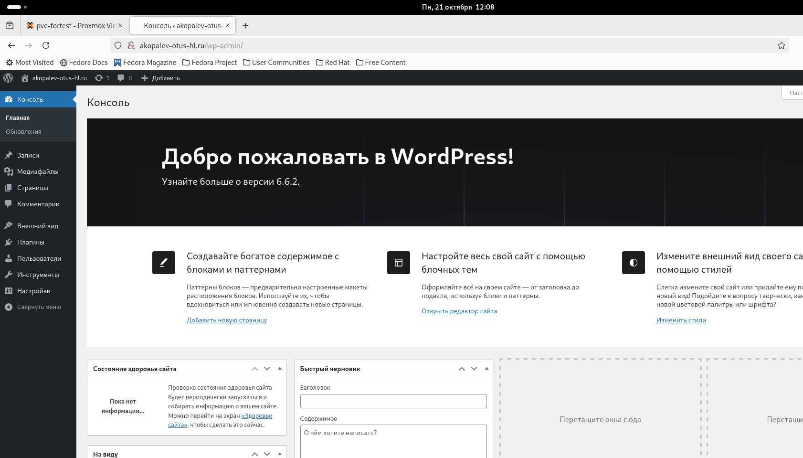
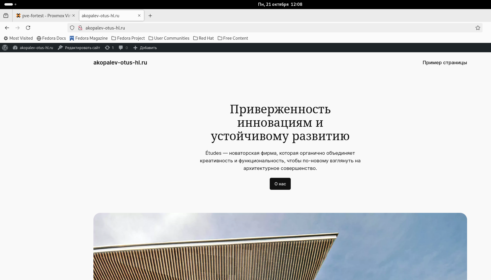

#  Копалев А. С. - Домашняя работа № 10

## Задача
Развертывание виртуальных машин на proxmox с помощью OpenTofu
#### Цель
OpenTofu скрипты для развертывания виртуальных машин на Proxmox
#### Описание/Пошаговая инструкция выполнения домашнего задания:
Написать OpenTofu скрипты для развертывания виртуальных машин на Proxmox.
#### Выполнение
Для развёртки инфраструктуры на сервере Proxmox используем OpenTofu и провайдера Telmate/terraform-provider-proxmox. С их помощью создаем 3 виртуальные машины.
- 1 виртуальная машина bast-host с внешним IP-адресом, доступная по SSH, реализующая SSH доступ к остальным виртуалкам
- 1 виртуальная машина для БД MySQL
- 1 виртуальная машина для бэкенда Wordpress

[main.tf](./main.tf)

Через Ansible реализуются 3 роли:
 - "chrony" - установка и синхронизация времени на всех виртуальных машинах
 - "db" - устанавливает MySQL, задает пароль root, создает БД, пользователя и пароль для Wordpress (переменные зашифрованы через ansible-vault)
 - "wordpress" - устанавливает на бэкенд сервере nginx и каталог wordpress, заменяет их конфиги
 
[playbook.yml](./ansible/playbook.yml)

## Скриншоты из Proxmox, созданного сайта, выводы при выполнении terraform apply и ansible-playbook playbook.yml

- созданные виртуальные машины
  

- созданные сетевые адаптеры и бриджи
  

- Заканчиваем установку Wordpress
  

- Работа админки сайта

- Работа сайта

- вывод terraform и ansible
  
- [terraform-output.txt](Files/tofu-output.txt)
  
- [ansible-output.txt](Files/ansible-output.txt)