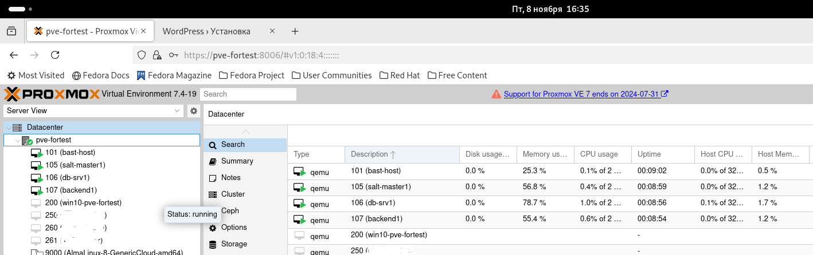
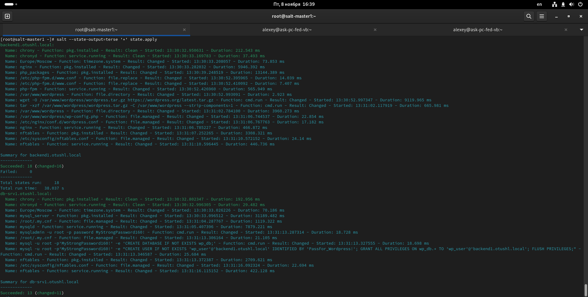
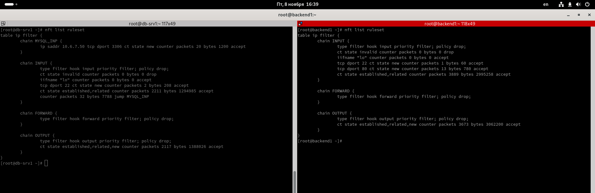
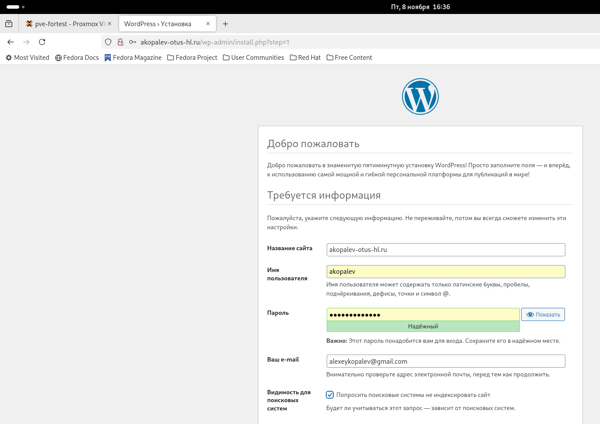
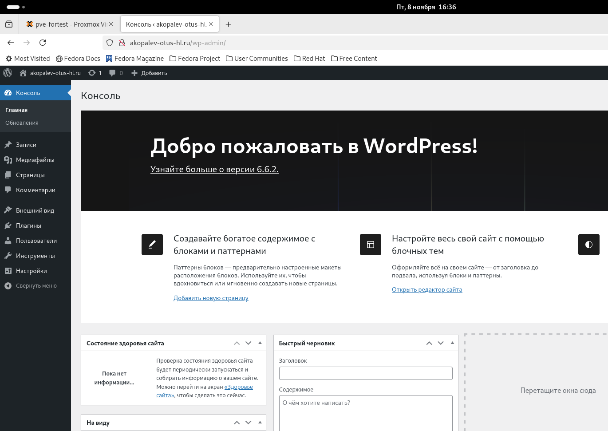
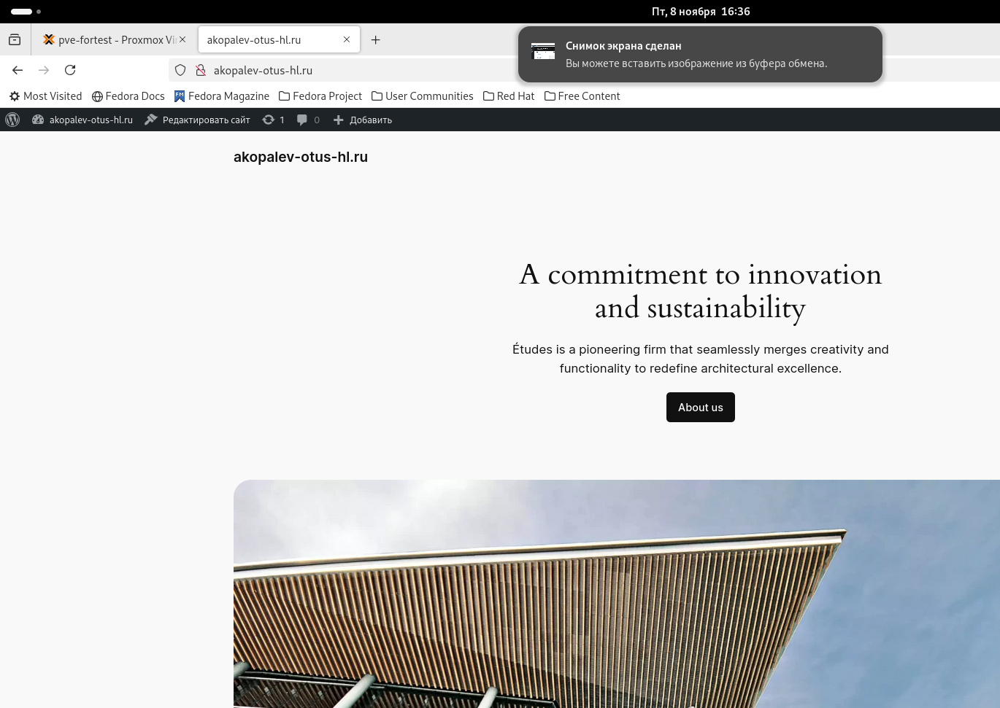

#  Копалев А. С. - Домашняя работа № 11

## Задача
Управление конфигурацией на несколько серверов
#### Цель
настроить управление конфигурацией проекта ( предыдущее ДЗ) через salt
#### Описание/Пошаговая инструкция выполнения домашнего задания:
добавить в проект salt server;
добавить на конечные ноды миньоны солта;
настроить управление конфигурацией nginx и iptables.
#### Выполнение
Для развёртки инфраструктуры использовался Ansible.
Через Ansiblem в Proxmox (ansible-playbook create-mv.yml) создаются следующие ресурсы:
- 1 виртуальная машина bast-host с внешним IP-адресом, доступная по SSH, реализующая SSH доступ к остальным виртуалкам
- 1 виртуальная машина для БД MySQL
- 2 виртуальные машины для бэкенда Wordpress
- 1 виртуальная машина с Salt Master и конфигурацией для minion (server mysql и server nginx+wordpress)

[create-vms.txt](./files/create-vms.txt)

Через Salt реализуются 3 ролb:
 - "chrony" - установка и синхронизация времени на всех виртуальных машинах
 - "mysql" - устанавливает MySQL, задает пароль root, создает БД, пользователя и пароль для Wordpress
 - "wordpress" - устанавливает на бэкенд сервера nginx и wordpress, заменяет их конфиги
 - на каждом миньене настроена firewall nftables
 
[playbook.yml](./playbook.yml)

[top.sls](./roles/salt-master/files/srv/salt/top.sls)

[mysql-init.sls](./roles/salt-master/files/srv/salt/mysql/init.sls)

[wordpress-init.sls](./roles/salt-master/files/srv/salt/wordpress/init.sls)

## Скриншоты из Proxmox, созданного сайта, выводы при выполнении ansible-playbook playbook.yml

- созданные виртуальные машины в Proxmox
  

- Вывод salt --state-output=terse '*' state.apply с salt-master1
  

- Вывод правил nftables на миньонах
  

- Заканчиваем установку Wordpress
  

- Работа админки сайта

- Работа сайта

- вывод ansible-playbook playboor.yml
  
- [ansible-output.txt](files/ansible-output.txt)

- [salt-output.txt](files/salt-output.txt)

### Для удаления инфраструктуры реализована роль - remove-vm. Запуск командой - ansible-playbook remove-vm.yml

- [remove-vms.txt](files/remove-vms.txt)